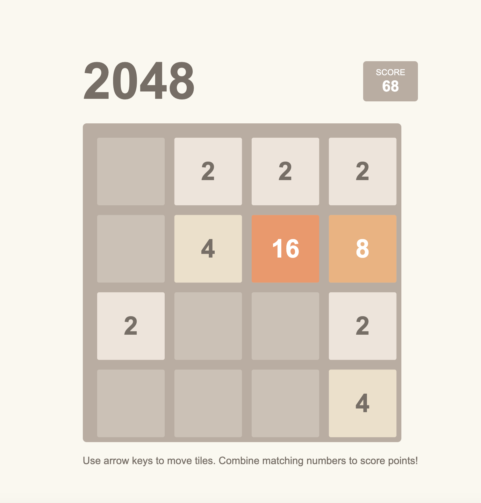
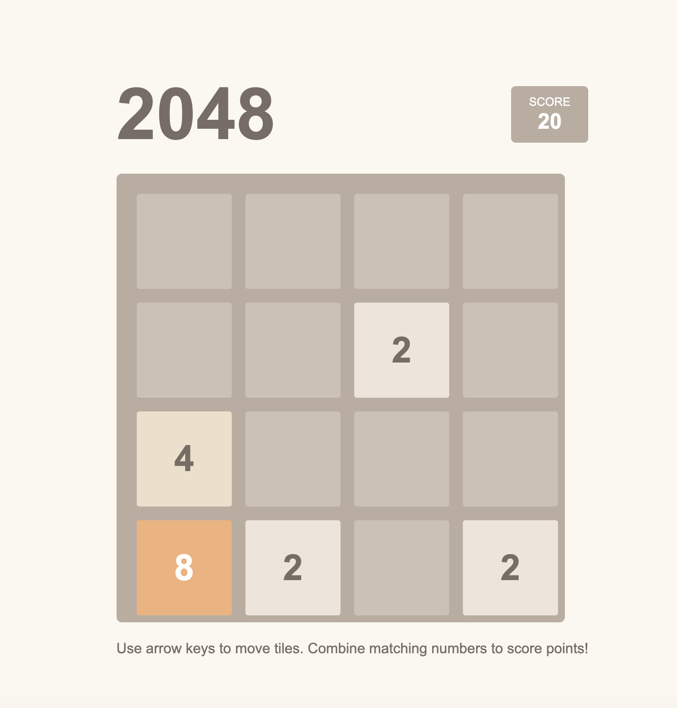

# 2048 Game

A modern implementation of the classic 2048 puzzle game with smooth animations and mobile support.

🎮 [Play Live Demo](https://ar-2048-game.netlify.app)

[](https://app.netlify.com/sites/ar-2048-game/deploys)

## Game Preview

<div align="center">
  
  <p><em>Initial Game State</em></p>
  
  
  <p><em>Game in Progress - Merging Tiles</em></p>
</div>

## Features

- 🎮 Smooth tile animations
- 📱 Mobile-friendly with touch/swipe support
- 🎯 Score tracking
- 🌓 Clean, modern UI
- 📊 Game over detection
- 🎲 Win condition (2048 tile)
- 📱 Responsive design for all screen sizes

## How to Play

1. Use arrow keys (desktop) or swipe gestures (mobile) to move tiles
2. Tiles with the same number merge when they collide
3. After each move, a new tile appears (2 or 4)
4. Combine tiles to create the 2048 tile to win!
5. If no moves are possible, the game is over

### Controls

**Desktop:**
- ⬆️ Up Arrow: Move tiles up
- ⬇️ Down Arrow: Move tiles down
- ⬅️ Left Arrow: Move tiles left
- ➡️ Right Arrow: Move tiles right

**Mobile:**
- Swipe Up: Move tiles up
- Swipe Down: Move tiles down
- Swipe Left: Move tiles left
- Swipe Right: Move tiles right

## Play Online

Visit [ar-2048-game.netlify.app](https://ar-2048-game.netlify.app) to play the game online!

## Development

### Technologies Used

- HTML5
- CSS3
- JavaScript (ES6+)
- Netlify for deployment

### Local Development

1. Clone the repository:
   ```bash
   git clone https://github.com/ali-r-dev/2048.git
   ```

2. Open `index.html` in your browser to play locally

## Future Enhancements

Planned features for future releases:

- [ ] Best score tracking
- [ ] Game state saving
- [ ] Additional themes
- [ ] Animation customization
- [ ] Sound effects
- [ ] Additional game modes

## Contributing

1. Fork the repository
2. Create your feature branch (`git checkout -b feature/AmazingFeature`)
3. Commit your changes (`git commit -m 'Add some AmazingFeature'`)
4. Push to the branch (`git push origin feature/AmazingFeature`)
5. Open a Pull Request

## License

This project is licensed under the MIT License - see the [LICENSE](LICENSE) file for details.

## Acknowledgments

- Original 2048 game by Gabriele Cirulli
- Inspiration from various 2048 implementations
- Community feedback and contributions
- Hosted on [Netlify](https://www.netlify.com/)

## Contact

Ali Raza - [GitHub](https://github.com/ali-r-dev)

Project Links:
- GitHub: [https://github.com/ali-r-dev/2048](https://github.com/ali-r-dev/2048)
- Live Demo: [https://ar-2048-game.netlify.app](https://ar-2048-game.netlify.app)
